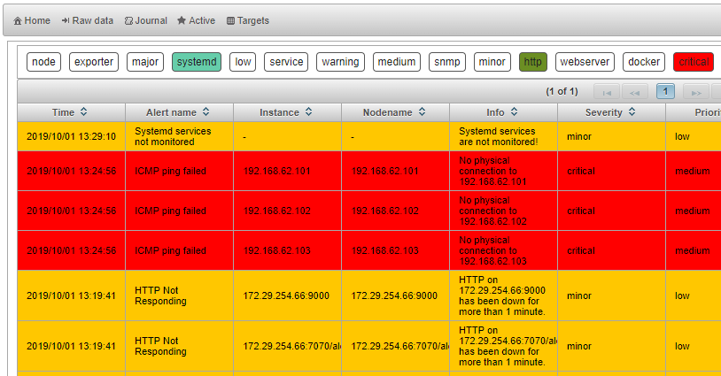

# Alertmonitor for Prometheus

[](https://semaphoreci.com/matjaz99/alertmonitor)
[](https://GitHub.com/matjaz99/alertmonitor/releases/)
[](https://GitHub.com/matjaz99/alertmonitor/releases/)
[](http://hits.dwyl.io/matjaz99/alertmonitor)
[](https://hub.docker.com/r/matjaz99/alertmonitor)
[](https://GitHub.com/matjaz99/alertmonitor/issues/)

Alertmonitor is a webapp for displaying alerts from Prometheus. It offers a nice GUI with lots of cool features for browsing, 
sorting and filtering alerts.

A HTTP webhook accepts any GET or POST request that comes on URI endpoint: `/alertmonitor/webhook`. 
If the request is coming from Prometheus Alertmanager, it will be displayed as alarm.

Alertmonitor provides the following views:
- Webhook - any http message that is received on webhook
- Journal - history of all events
- Active - only active alerts
- Targets - alerts sorted by targets
- Statistics - statistical data
- About - general information and configuration options

Alertmonitor correlates firing alerts and resolving alerts to display current state of active alarms.

Alerts can be filtered by tags.

Alertmonitor supports periodic synchronization of active alerts with Prometheus. This feature is extremely useful after a broken connection 
to refresh the state of currently active alerts.





## Quick start

The easiest way to start using Alertmonitor is to deploy it on Docker.

Deploy container:

```
docker run -d -p 8080:8080 matjaz99/alertmonitor:latest
```

Alertmonitor is reachable on: [http://hostname:8080/alertmonitor/](http://hostname:8080/alertmonitor/)


There is also `docker-compose.yml` file available for deployment in Swarm cluster.


### Docker images

Docker images are available on Docker hub: [https://hub.docker.com/r/matjaz99/alertmonitor](https://hub.docker.com/r/matjaz99/alertmonitor)


## Configure alerts in Prometheus

Alertmonitor relies on properly configured labels in Prometheus alert rules. 
Placing additional labels into alert rules will enrich the information that alert carries, such as: 
severity, metric labels, current metric value, alert tags or team responsible for resolving alerts.

#### Labeling alerts

Alertmonitor recognizes the following labels:

| Label       |      Description        |
|-------------|-------------------------|
| severity    | Mandatory (default=indeterminate). Severity is the weight of event. Possible values: `critical`, `major`, `minor`, `warning`, `clear` and `informational` |
| priority    | Optional (default=low). Priority tells how urgent is alarm. Possible values: `high`, `medium`, `low` |
| info        | Mandatory. Detailed information about the alert. **Important: Info may not contain variables which change over the time (such as current metric value), because it creates new time series of alerts each time and the correlation will not work.!** |
| hostname    | Optional. `instance` is usually already included in metric, but sometimes if alert rule doesn't return hostname (eg. containers in swarm), you can provide its value here by any other means. Usually IP address and port of exporter. |
| nodename    | Optional. Descriptive name of hostname. Eg. hostname |
| tags        | Optional. Custom tags that describe the alert (comma separated). Tags are used for quick filtering in Alertmonitor. |
| team        | Optional. Team responsible for this kind of alerts. |
| url        | Optional. Custom URL that is related to alert. |
| eventType   | Optional. Event type according to IUT-T X.733 recommendation |
| probableCause | Optional. Probable cause according to IUT-T X.733 recommendation |
| description | Optional. Additional description. Value is read from a label if exists, otherwise from annotation. |
| currentValue | Optional. Current metric value. Get it with: `{{ humanize $value }}`. Append units (eg. % or MB) if you need to do so. **Important: Current value may not be in `labels` section of alert rule but inside `annotations`!** |

> `correlationId` is defined by: `alertname`, `info`, `hostname` and `job`. Clear event should produce the same `correlationId`.

Example of alert rule in Prometheus (note the labels):

```yaml
groups:
- name: my-alerts
  rules:
  - alert: CPU usage
    expr: sum(rate(process_cpu_seconds_total[5m])) by (hostname) * 100 > 80
    for: 1m
    labels:
      # mandatory labels
      severity: critical
      priority: low
      info: CPU alert for Node '{{ $labels.node_name }}'
      # optional labels
      nodename: '{{$labels.node_name}}'
      hostname: '{{$labels.hostname}}'
      tags: hardware, cpu, overload
      team: Team1
      url: 'http://${GRAFANA_HOSTNAME}/dashboard/'
      eventType: 5
      probableCause: 1024
      description: Node {{ $labels.hostname }} CPU usage is at {{ humanize $value}}%.
    annotations:
      description: Node {{ $labels.hostname }} CPU usage is at {{ humanize $value}}%.
      summary: CPU alert for Node '{{ $labels.hostname }}'
      currentValue: '{{ humanize $value }}%'
```

> For other integrations you might still need `description` and `summary` in annotations. Alertmonitor reads them from labels.


#### Configure webhook receiver in Alertmanager

In order to receive alerts, configure an Alertmonitor receiver endpoint in `alertmanager.yml` configuration file.

```yaml
route:
  receiver: alertmonitor
  group_by: [alertname]
  group_wait: 10s
  group_interval: 5m
  repeat_interval: 3h

receivers:
- name: alertmonitor
  webhook_configs:
  - url: http://alertmonitor:8080/alertmonitor/webhook
    send_resolved: true
```


## Views

#### Active alerts view

This view shows currently active alerts.

Active alerts can be filtered by selecting one or more tags.

Deselect all tags to show all alerts.

#### Journal view

This view shows all history of received events. The size of journal is limited by `ALERTMONITOR_JOURNAL_SIZE` parameter. 
When journal reaches its maximum size, the oldest events will be removed (First in, first out).

Remark: all the data in Alertmonitor is based on journal events. For example, Alertmonitor can only show targets, 
which have at least one alert recorded in journal.

#### Webhook view

This view shows raw messages as they were received by the HTTP webhook.

#### Target view

Alertmonitor strips protocol and port from `instance` label and what remains is target's hostname or IP address or FQDN.

Alertmonitor then filters alerts and displays those who's hostnames match.

Each target shows number of active alerts and an icon indicating the highest severity of raised alert.

#### Statistics view

This view shows statistical data, such as:
- number of alerts by severity
- number of received messages/alerts
- timers (up time, time since last event...)
- psync success rate

#### About view

Application meta data, version, build info...

At the moment, only periodic sync endpoint can be configured (no restart required).


## Configuration

#### Application configuration

The Alertmonitor can be configured with environment variables. Variables starting with `ALERTMONITOR_*` are related 
to behaviour of the application, while other variables may be used for other purposes 
(such as logger configuration or custom environment variable substitution).

A list of supported environment variables:

| EnvVar                             | Default value           | Description        |
|------------------------------------|-------------------------|------------------- |
| ALERTMONITOR_JOURNAL_SIZE          | 20000 | Maximum journal size (FIFO). |
| ALERTMONITOR_PSYNC_INTERVAL_SEC    | 900 | Periodic synchronization interval in seconds |
| ALERTMONITOR_PSYNC_ENDPOINT        | http://localhost/prometheus/api/v1/alerts | The URL of Prometheus API for querying alerts |
| ALERTMONITOR_DATE_FORMAT           | yyyy/MM/dd H:mm:ss | Date format for displaying in GUI |

#### Environment variable substitution

Prometheus doesn't support substitution of environment variables in alert rules. Alertmonitor does that for you.

Environment variables can be set on system level or directly on docker containers. Example in docker-compose file.

```yaml
    environment:
      - GRAFANA_HOSTNAME: my.grafana.domain
```

Template syntax in labels to be replaced: `${GRAFANA_HOSTNAME}`.

Alertmonitor will replace all occurrences of templates with corresponding environment variables.

You can use environment variable substitution on the following labels:
- `nodename`
- `info`
- `tags`
- `url`
- `description`


## Metrics

Alertmonitor supports the following metrics in Prometheus format:
- `alertmonitor_build_info`
- `alertmonitor_webhook_messages_received_total`
- `alertmonitor_journal_messages_total`
- `alertmonitor_active_alerts_count`
- `alertmonitor_alerts_balance_factor`
- `alertmonitor_last_event_timestamp`
- `alertmonitor_psync_task_total`
- `alertmonitor_psync_interval_seconds`

Metrics are available on URI endpoint:

```
GET /alertmonitor/metrics
```

## Log files

Configure the log file location with environment variable `SIMPLELOGGER_FILENAME=/opt/alertmonitor/log/alertmonitor.log`

Rolling file policy can be also configured. For complete simple-logger configuration visit [https://github.com/matjaz99/simple-logger](https://github.com/matjaz99/simple-logger)

## For developers

Alertmonitor is written in Java. It's a maven project. It runs as web app on Apache Tomcat server and uses JSF 2.2 with Primefaces 6.2 for frontend interface.
In version 1.5.1 I switched from Java 8 to Java 13. I had to add `javax.annotations` dependency to pom.xml file.

Primefaces showcase: http://www.primefaces.org:8080/showcase

### Simple-logger maven dependency

Simple-logger is not available on Maven central repo. You can either build it on your own 
or download jar file from [here](http://matjazcerkvenik.si/download/simple-logger-1.7.0.jar) 
and then manually import it into your local repository:

```
wget http://matjazcerkvenik.si/download/simple-logger-1.7.0.jar

mvn install:install-file -Dfile=simple-logger-1.7.0.jar -DgroupId=si.matjazcerkvenik.simplelogger -DartifactId=simple-logger -Dversion=1.7.0 -Dpackaging=jar
```

Run the project with maven:

```
mvn tomcat7:run
```

### Docker

Build docker image and push to docker hub:

```
docker build -t {{namespace}}/{{image}}:{{tag}} .
docker push {{namespace}}/{{image}}:{{tag}}
```

Inside container log files are located in directory `/opt/alertmonitor/log`
