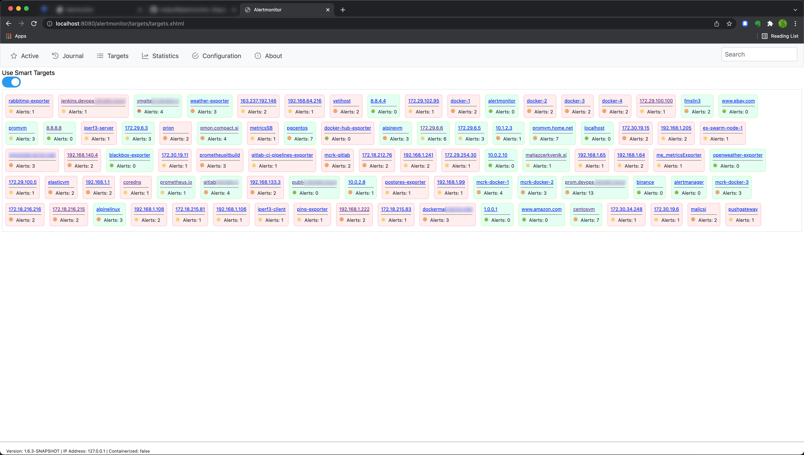
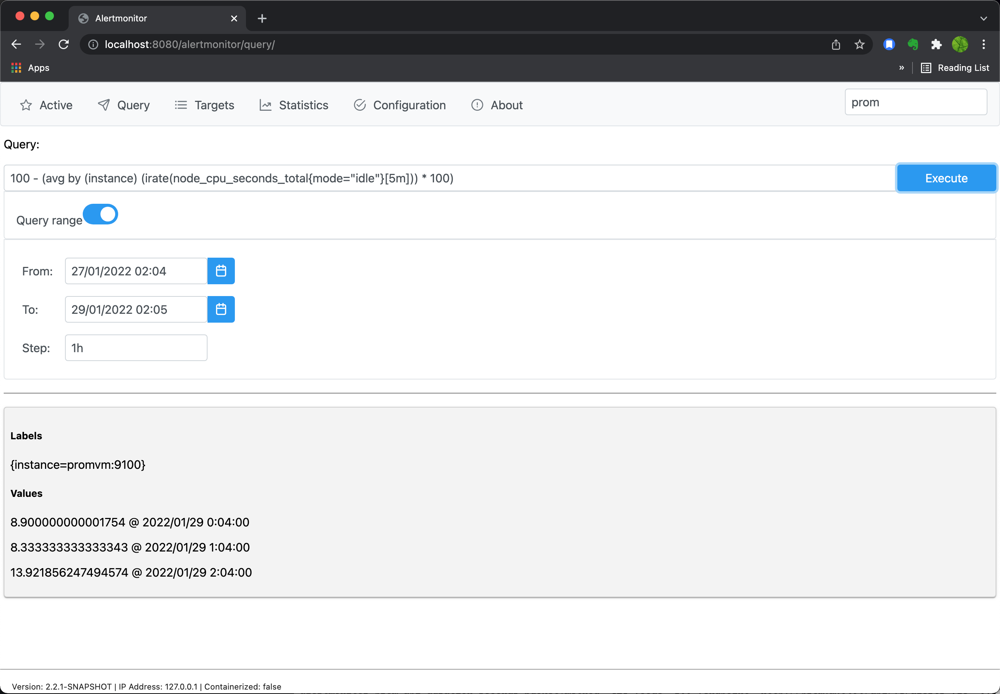

# Alertmonitor for Prometheus

[](https://semaphoreci.com/matjaz99/alertmonitor)
[](https://GitHub.com/matjaz99/alertmonitor/releases/)
[](https://GitHub.com/matjaz99/alertmonitor/releases/)
[](https://hub.docker.com/r/matjaz99/alertmonitor)
[](https://GitHub.com/matjaz99/alertmonitor/issues/)

Alertmonitor is a webapp for displaying active alerts in Prometheus.

Alertmonitor receives alerts from Alertmanager on the HTTP endpoint: `/alertmonitor/webhook`. 
Alternatively, if webhook receiver is not configured, Alertmonitor can pull alerts directly from Prometheus. 
Ideally both approaches should be used in combination. This way you'll always receive alert immediately when it is fired, and yet it 
*synchronizes* alerts with Prometheus in case if any alert (or clear) has been lost.

Alertmonitor automatically correlates firing and resolving alerts to display current state of active alarms.

Alertmonitor displays monitored objects as Instances or SmartTargets. Instance is one particular exporter on a server, while 
SmartTarget combines all instances on the same server and displays all active alerts on that server.

Alertmonitor supports PromQL for making queries and range queries.

Tags provide a quick way of filtering alerts.

Alertmonitor can store alerts in MongoDB database. It stores all incoming messages 
and whole journal (history) of alerts.

Screenshots:

  

  




## Quick start

Deploy Alertmonitor on Docker:

```
docker run -d -p 8080:8080 matjaz99/alertmonitor:latest
```

Open web browser and go to address: [http://hostname:8080/alertmonitor/](http://hostname:8080/alertmonitor/)


There is also `docker-compose.yml` file available for deployment in Swarm cluster.


### Docker images

Docker images are available on Docker hub: [https://hub.docker.com/r/matjaz99/alertmonitor](https://hub.docker.com/r/matjaz99/alertmonitor)


## Configure alerts in Prometheus

Alertmonitor strongly relies on properly configured labels in alert rules. 
Placing additional labels into alert rules will enrich the information that alert carries, such as: 
severity, metric labels, current metric value, alert tags or group name.

### Labeling alerts

Alertmonitor recognizes the following labels:

| Label         | Description                                                                                                                                                                                                                                          |
|---------------|------------------------------------------------------------------------------------------------------------------------------------------------------------------------------------------------------------------------------------------------------|
| severity      | Optional (default=indeterminate). Severity is the weight of event. Possible values: `critical`, `major`, `minor`, `warning`, `clear` and `informational`                                                                                             |
| priority      | Optional (default=low). Priority tells how urgent is alarm. Possible values: `high`, `medium`, `low`                                                                                                                                                 |
| info          | Mandatory. Detailed information about the alert. **Important: Info may not contain variables which change over the time (such as current metric value), because it creates new time series of alerts each time and the correlation will not work.!** |
| instance      | Optional. `instance` is usually already included in metric, but sometimes if alert rule doesn't return instance, you can provide its value here by any other means. Usually IP address and port of exporter.                                         |
| nodename      | Optional. Name of this instance.                                                                                                                                                                                                                     |
| tags          | Optional. Custom tags that describe the alert (comma separated). Tags are used for quick filtering in Alertmonitor.                                                                                                                                  |
| group         | Optional. Custom group name.                                                                                                                                                                                                                         |
| url           | Optional. Custom URL that is related to alert.                                                                                                                                                                                                       |
| eventType     | Optional. Event type according to IUT-T X.733 recommendation                                                                                                                                                                                         |
| probableCause | Optional. Probable cause according to IUT-T X.733 recommendation                                                                                                                                                                                     |
| description   | Optional. Additional description. Value is read from a labels section if it exists, otherwise from annotations section.                                                                                                                              |
| currentValue  | Optional. Current metric value. Get it with: `{{ humanize $value }}`. Append units (eg. % or MB) if you need to do so. **Important: Current value may not be in `labels` section of alert rule but inside `annotations`!**                           |

> Alert's `correlationId` is defined by: `alertname`, `info`, `instance` and `job`. Clear event should produce the same `correlationId`.

> It is highly recommended to write alert rules in such manner that `instance`, `job` and `info` are always present in the resulting alert.

Example of alert rule in Prometheus:

```yaml
groups:
- name: my-alerts
  rules:
  - alert: High CPU usage
    expr: sum(rate(process_cpu_seconds_total[5m])) by (instance) * 100 > 80
    for: 1m
    labels:
      severity: critical
      info: CPU alert for Node '{{ $labels.instance }}'
      tags: hardware, server, cpu, overload
      url: 'http://${GRAFANA_HOSTNAME}/dashboard/'
      description: Node {{ $labels.instance }}
    annotations:
      currentValue: '{{ $value }}%'
```


### Configure webhook receiver in Alertmanager

In order to receive alerts, configure an Alertmonitor receiver endpoint in `alertmanager.yml` configuration file.

```yaml
route:
  receiver: alertmonitor
  group_by: [alertname]
  group_wait: 10s
  group_interval: 5m
  repeat_interval: 3h

receivers:
- name: alertmonitor
  webhook_configs:
  - url: http://alertmonitor:8080/alertmonitor/webhook
    send_resolved: true
```

## Data Providers

Since version 3, Alertmonitor supports Data Providers. Data providers are sources that will send data to 
Alertmonitor. It is possible to define more Prometheus servers or some other sources.

Data Providers are configured in `providers.yml` configuration file.

Each Data Provider has assigned one URI endpoint. All requests received on that endpoint will be processed 
by corresponding Data Provider.

> It is not recommended to configure two or more providers to send events to the same URI endpoint!


## Alertmonitor GUI

Alertmonitor offers the following views.

### Active alerts

This view shows all currently active alerts.

Active alerts can be filtered by selecting one or more tags. Deselect all tags to show all alerts.

Search (in upper right corner) allows searching alerts by: `instance`, `alertname`, `info`, `job`, `description`. Search can 
be used in combination with tags.

### Query

Query view provides a GUI for executing PromQL queries. Two types of queries are supported: `query` and `query_range`. 
When executing query range, start/end date and step are configurable.

### Journal

This view shows all history of received events. The size of journal is limited by `ALERTMONITOR_JOURNAL_SIZE` parameter. 
When journal reaches its maximum size, the oldest events will be removed (First in, first out).

Remark: all the data in Alertmonitor is based on journal events. For example, Alertmonitor can only show targets, 
which have at least one alert recorded in journal.

### Webhook

This view shows raw messages as they were received by the HTTP webhook.

### Target

Alertmonitor strips protocol and port from `instance` label and what remains is target's hostname or IP address or FQDN.

Alertmonitor then filters alerts and displays those who's hostnames match.

Each target shows number of active alerts and an icon indicating the highest severity of raised alert.

### Statistics

This view shows statistical data, such as:
- number of alerts by severity
- number of received messages/alerts
- timers (up time, time since last event...)
- psync success rate

### Report

Report is an overview of the whole monitoring system. It shows some statistics of Alertmonitor 
and Prometheus. It also shows the status of instances, average availability and other KPIs.  
Most KPIs and metrics are queried from Prometheus.

### Configuration

Here it is possible to change some configuration parameters during runtime.

### About

Application meta data, version, build info, maintainers, public channels...


## Persistence

Alertmonitor supports the following data storage options:
- In memory
- MongoDB
- Kafka (experimental)

In memory option works out-of-the-box without any configuration.

To enable MongoDB data storage, set the environment variable `ALERTMONITOR_MONGODB_ENABLED` to `true` 
and configure `ALERTMONITOR_MONGODB_CONNECTION_STRING`.  MongoDB is disabled by default. 
Data is deleted according to retention policy (`ALERTMONITOR_DATA_RETENTION_DAYS`).  
Alertmonitor will automatically create new database `alertmonitor` in MongoDB, if it doesn't exist yet.

Kafka is experimental feature. If enabled, Alertmonitor will send all alerts to Kafka topic. 
This feature might be useful for further processing and analytics of alarms.


## Configuration

### Application configuration

Alertmonitor can be configured with environment variables. Variables starting with `ALERTMONITOR_*` are related 
to behaviour of the application, while other variables may be used for other purposes 
(such as logger configuration or custom environment variable substitution).

> With environment variables, only `.default` data provider (Prometheus) can be configured. Other providers 
are configured in `providers.yml`.

A list of supported environment variables:

| EnvVar                                    | Description                                                                                            |
|-------------------------------------------|--------------------------------------------------------------------------------------------------------|
| ALERTMONITOR_DATAPROVIDERS_CONFIG_FILE    | Filepath to providers configuration file.  Default: /opt/providers.yml                                 |
| ALERTMONITOR_DATA_RETENTION_DAYS          | History data in days.  Default: 7                                                                      |
| ALERTMONITOR_PSYNC_INTERVAL_SEC           | Periodic synchronisation interval in seconds.  Default: 900                                            |
| ALERTMONITOR_PROMETHEUS_SERVER            | The URL of Prometheus server.  Default: http://localhost:9090                                          |
| ALERTMONITOR_PROMETHEUS_CLIENT_POOL_SIZE  | Pool size of http clients for communication with Prometheus API.  Default: 1                           |
| ALERTMONITOR_HTTP_CLIENT_READ_TIMEOUT_SEC | Timeout of http client requests.  Default: 120                                                         |
| ALERTMONITOR_DATE_FORMAT                  | Date format for displaying in GUI.  Default: yyyy/MM/dd H:mm:ss                                        |
| ALERTMONITOR_KAFKA_ENABLED                | Enable or disable publishing to Kafka. This is experimental feature!  Default: false                   |
| ALERTMONITOR_KAFKA_SERVER                 | Hostname and port for Kafka.  Default: hostname:9092                                                   |
| ALERTMONITOR_KAFKA_TOPIC                  | Name of topic.  Default: alertmonitor_notifications                                                    |
| ALERTMONITOR_MONGODB_ENABLED              | Enable or disable storing data to MongoDB. If disabled, data is stored in memory only.  Default: false | 
| ALERTMONITOR_MONGODB_CONNECTION_STRING    | The connection string for MongoDB (username, password and host).                                       |

### Environment variable substitution

Prometheus doesn't support substitution of environment variables in alert rules. Alertmonitor does that for you.

Environment variables can be set on system level or directly on docker containers. Example in docker-compose file.

```yaml
    environment:
      - GRAFANA_HOSTNAME: my.grafana.domain
```

Template syntax in labels to be replaced: `${GRAFANA_HOSTNAME}`.

Alertmonitor will automatically replace all occurrences of templates with corresponding environment variables.

Example when comes this handy: you may link an alert with Grafana dashboard by using `url` label: `http://${GRAFANA_HOSTNAME}/dashboard`. 
Alertmonitor will search environment variables for suitable substitution and if it finds one, it will produce label: 
`url: http://my.grafana.domain/dashboard`.

Environment variable substitution works on the following labels:
- `nodename`
- `info`
- `tags`
- `url`
- `description`


## Metrics

Metrics are available in Prometheus format on URI endpoint:

```
GET /alertmonitor/metrics
```

Alertmonitor supports the following metrics in Prometheus format:
- `alertmonitor_build_info`
- `alertmonitor_webhook_messages_received_total`
- `alertmonitor_journal_messages_total`
- `alertmonitor_active_alerts_count`
- `alertmonitor_alerts_balance_factor`
- `alertmonitor_last_event_timestamp`
- `alertmonitor_prom_api_duration_seconds`
- `alertmonitor_psync_interval_seconds`


## Log files

Inside container log files are located in directory `/opt/alertmonitor/log`.

Configure the log file location with environment variable `SIMPLELOGGER_FILENAME=/opt/alertmonitor/log/alertmonitor.log`

Rolling file policy can be also configured. For complete configuration of simple-logger visit [https://github.com/matjaz99/simple-logger](https://github.com/matjaz99/simple-logger)


## For developers

### Community

Google group for Alertmonitor Users:

https://groups.google.com/g/alertmonitor-users

### Dependencies

Alertmonitor is written in Java. It's a maven project. It runs as web app on Apache Tomcat server and uses JSF 2.2 with Primefaces 11.0 for frontend interface.
In version 1.5.1 I switched from Java 8 to Java 13. I had to add `javax.annotations` dependency to pom.xml file.

### Simple-logger maven dependency

Sorry, simple-logger is not available on Maven central repo. You can either build it on your own 
or download jar file from [here](http://matjazcerkvenik.si/download/simple-logger-1.7.0.jar).  
Then manually import it into your local repository:

```
wget http://matjazcerkvenik.si/download/simple-logger-1.7.0.jar

mvn install:install-file -Dfile=simple-logger-1.7.0.jar -DgroupId=si.matjazcerkvenik.simplelogger -DartifactId=simple-logger -Dversion=1.7.0 -Dpackaging=jar
```

Run the project with maven:

```
mvn tomcat7:run
```

### Docker

Build docker image and push to docker hub:

```
docker build -t {{namespace}}/{{image}}:{{tag}} .
docker push {{namespace}}/{{image}}:{{tag}}
```


